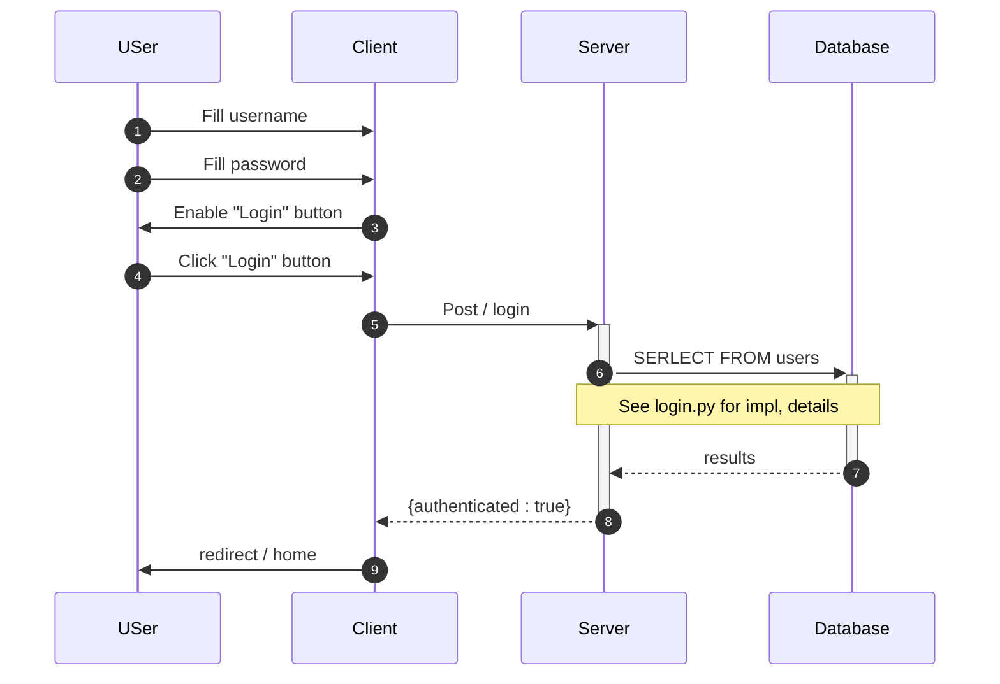

```mermaid
sequenceDiagram
    autonumber
    participant U as USer
    participant C as Client
    participant S as Server
    participant D as Database
    U ->> C : Fill username
    U ->> C : Fill password
    C ->> U : Enable "Login" button
    U ->> C : Click "Login" button

    C ->> +S : Post / login
        S ->> +D : SERLECT FROM users
        Note over S,D : See login.py for impl, details
        D -->> -S : results
    S -->> -C : {authenticated : true}
    
    C ->> U : redirect / home
```