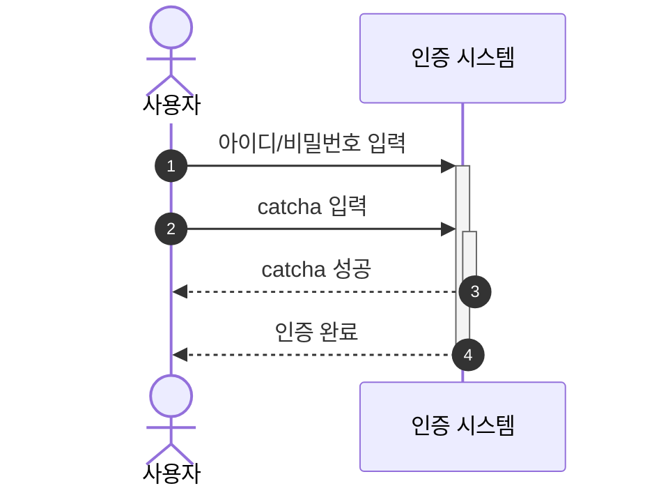
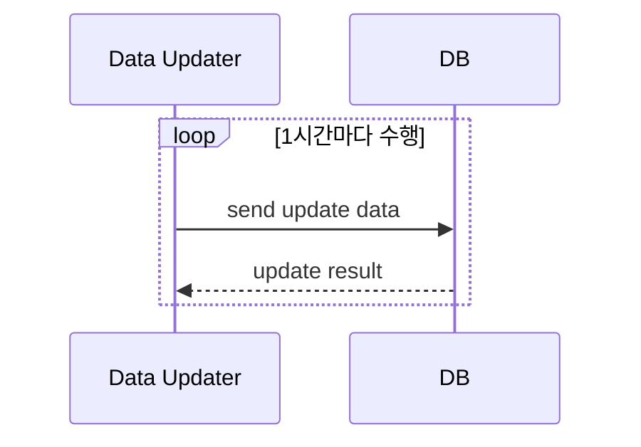
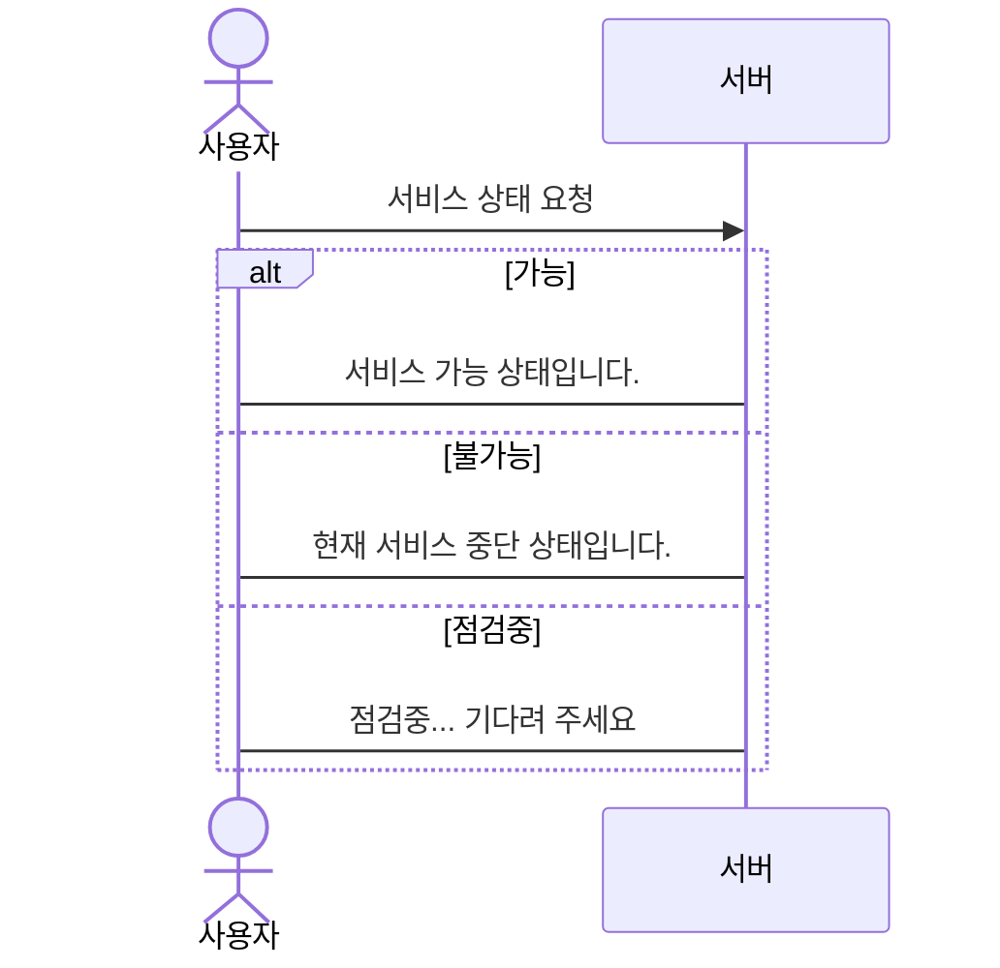

- 순서도 실습
    - 두번째 실습(Sequence Diagram)

```mermaid
sequenceDiagram
    autonumber
    actor A as 사용자
    participant B as 인증 시스템
    A ->>+ B: 아이디/비밀번호 입력
    A ->>+ B: catcha 입력
    B -->>- A: catcha 성공
    B -->>- A: 인증 완료
```
 
 

-----------

```mermaid
sequenceDiagram
    participant A as Data Updater
    participant B as DB
    loop 1시간마다 수행
        A ->> B: send update data
        B -->> A: update result
    end
```
 
 

-----------

```mermaid
sequenceDiagram
    actor A as 사용자
    participant B as 서버
    
    A ->> B: 서비스 상태 요청
    
    alt 가능
        B -> A: 서비스 가능 상태입니다.
    else 불가능
        B -> A: 현재 서비스 중단 상태입니다.
    else 점검중
        B -> A: 점검중... 기다려 주세요
    end
```