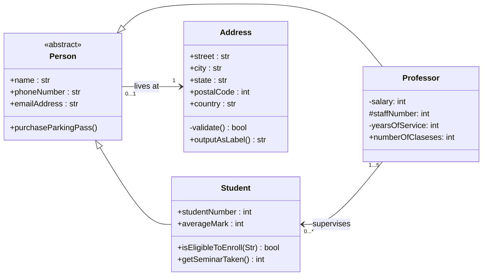

```mermaid
classDiagram
    direction LR

    class Person {
        <<abstract>>
        +name : str
        +phoneNumber : str
        +emailAddress : str
        +purchaseParkingPass()
    }
    class Student {
        +studentNumber : int
        +averageMark : int
        +isEligibleToEnroll(Str) bool
        +getSeminarTaken() int
    }
    class Address {
        +street : str
        +city : str
        +state : str
        +postalCode : int
        +country : str
        -validate() bool
        +outputAsLabel() str
    }
    class Professor {
        -salary: int
        #staffNumber: int
        -yearsOfService: int
        +numberOfClaseses: int
    }

    Person <|-- Student
    Person <|-- Professor
    Student "0...*" <-- "1...5" Professor : supervises
    Person "0...1" --> "1" Address : lives at
```