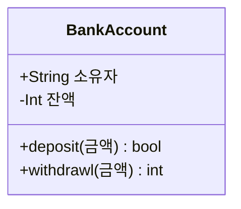
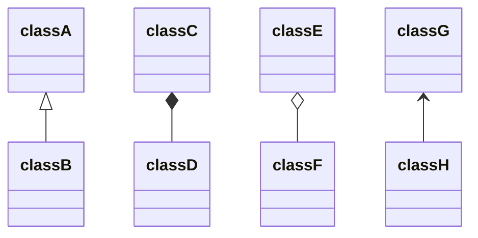
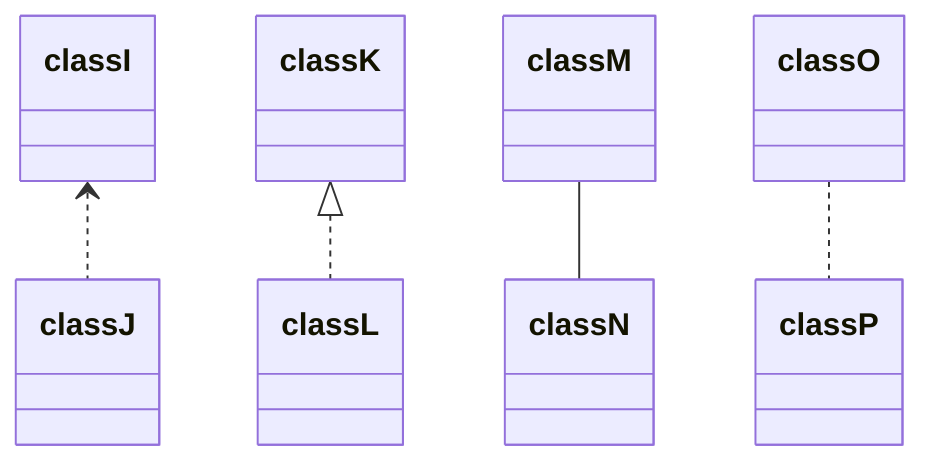
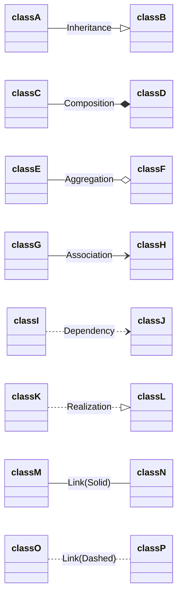
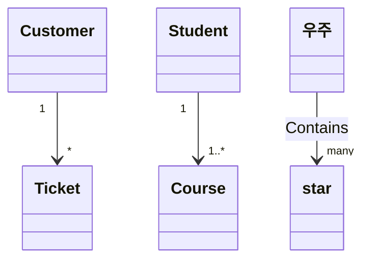
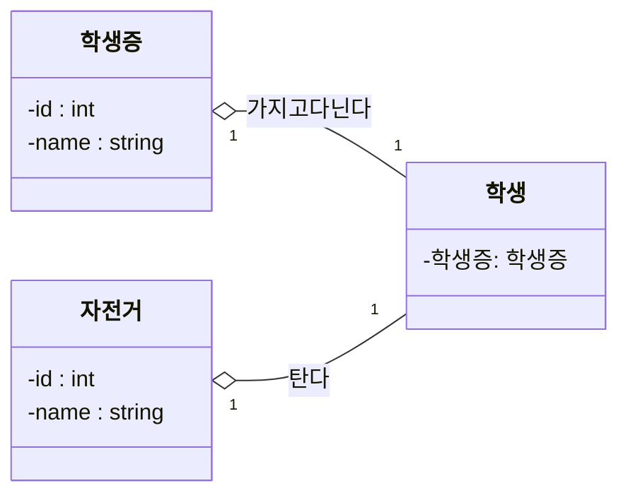
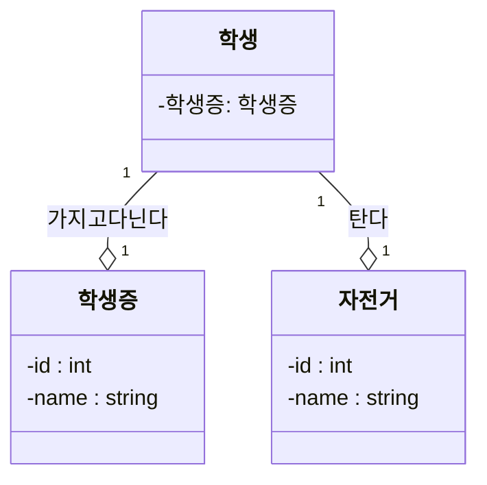

- 순서도 실습
    - 세번째 실습(ClassDiagram)

```mermaid
classDiagram
    class BankAccount{
        +String 소유자
        -Int 잔액
        +deposit(금액) bool
        +withdrawl(금액) int
    }
```
 
 

-----------

```mermaid
classDiagram
    classA <|-- classB
    classC *-- classD
    classE o-- classF
    classG <-- classH
```

```mermaid
classDiagram
    classI <.. classJ
    classK <|.. classL
    classM -- classN
    classO .. classP
```
 
 

```mermaid
classDiagram
    direction LR
    classA --|> classB : Inheritance
    classC --* classD : Composition
    classE --o classF : Aggregation
    classG --> classH : Association
    classI ..> classJ : Dependency
    classK ..|> classL : Realization
    classM -- classN : Link(Solid)
    classO .. classP : Link(Dashed)
```
 
 

-----------

```mermaid
classDiagram
    Customer "1" --> "*" Ticket
    Student "1" --> "1..*" Course
    우주 --> "many" star : Contains
```
 
 

-----------

```mermaid
classDiagram
  direction RL
  class 학생 {
    -학생증: 학생증
  }
  class 학생증 {
    -id : int
    -name : string
  }
  class 자전거 {
    -id : int
    -name : string
  }
  학생 "1" --o "1" 학생증 : 가지고다닌다
  학생 "1" --o "1" 자전거 : 탄다
```
 
 

-----------

```mermaid
classDiagram
  direction TB
  class 학생 {
    -학생증: 학생증
  }
  class 학생증 {
    -id : int
    -name : string
  }
  class 자전거 {
    -id : int
    -name : string
  }
  학생 "1" --o "1" 학생증 : 가지고다닌다
  학생 "1" --o "1" 자전거 : 탄다
```