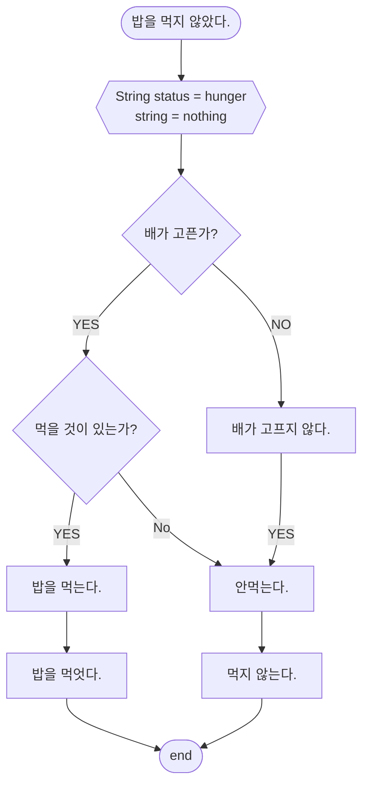

```mermaid
flowchart TB
    a([밥을 먹지 않았다.])
    b{{String status = hunger <br> string = nothing}}
    c{배가 고픈가?}
    d{먹을 것이 있는가?}
    e[밥을 먹는다.]
    f[밥을 먹엇다.]
    g([end])

    %%연결선 작업
    a --> b --> c -->|YES|d -->|YES|e --> f --> g

    h[안먹는다.]
    d -->|No|h
    i[먹지 않는다.]
    h --> i
    i --> g

    j[배가 고프지 않다.]
    c-->|NO| j -->|YES| h
```