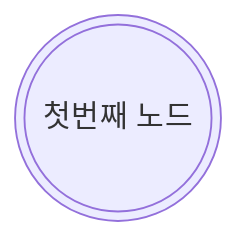
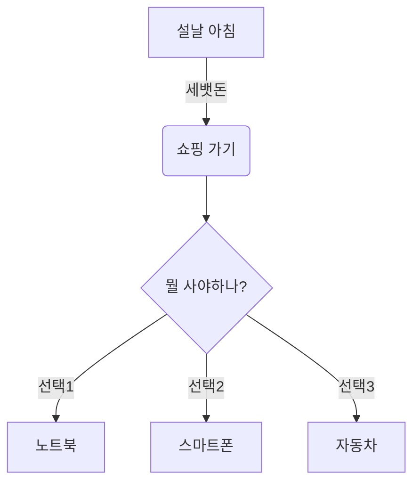

# Mermaod 실습(2022-11-09)
- 순서도 실습
    - 첫번째 실습(flowchart)
- 공식 사이트(https://mermaid-js.github.io/mermaid/#/)
- 교수님 페이지(https://kafa46.github.io/mermaid/intro.html)
- 주석은 (%%)로 한다.





- ` 이 기호는 mermaid 시작점과 끝점을 나타내는 기호로 사용하고 처음은 mermaid라고 적어주시기

```python
print("Hello world")
```

```Java
System.out.println("Hello world");
```